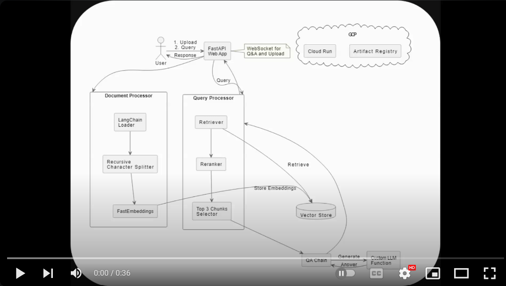

## Introduction

This project is a Retrieval-Augmented Generation (RAG) application built with FastAPI. It allows users to upload PDF documents, initiate chat sessions, and interact with an AI model that provides answers based on the content of the uploaded documents.

The application leverages state-of-the-art natural language processing techniques to provide accurate and context-aware responses to user queries.

### For complete working code please connect with me @https://www.linkedin.com/in/harsh-joshi-ai-engineer/

## Features

- PDF document upload and processing
- Session-based chat interactions
- Real-time chat using WebSockets
- HTTP POST endpoint for chat requests
- Asynchronous processing for improved performance
- Error handling and input validation
- Processing time tracking for responses
- Source attribution for answers

### Create a templates folder in root and put index.html and upload.html file in it.


## Technologies Used

- **Language**: Python 3.10+
- **Web Framework**: FastAPI
- **ASGI Server**: Uvicorn
- **Template Engine**: Jinja2
- **AI Framework**: LangChain
- **Vector Store**: FAISS
- **Embeddings**: FastEmbed (jinaai/jina-embeddings-v2-small-en)
- **LLM**: Meta LLAMA 3 8b Chat
- **Reranking**: Flashrank
- **Containerization**: Docker
- **Deployment and Registery**: GCP Cloud run and Artifact Registry 

## Video Demo (as the deployment for a longer time costs a lot for a side project)

[](https://www.youtube.com/watch?v=zofEZxCC1Zw)


#### RAG Working
1) Load document
2) Split and chunk
3) Embed , Create Vector store , Intialise the qna chain
4) Fetch similar document to given query
5) Perform reranking
6) Provide the result to llm as context to handle
7) Store quetion and answer in dict


#### To RUN fastapi server
```bash
uvicorn main:app --reload
```

#### Build Container
```bash
docker build -t rag_app_v1 .
```

#### Run Container
```bash
docker run -it -p 8000:8000 rag_app_v1
```
```bash
docker run -d -p 80:5000 -p 443:5000 rag_app_v1 (to redirect http and https traffic directly to application)
```

#### TODO
- Multilingual support (Multilingual embeddings such as cohere or "paraphrase-multilingual-mpnet-base-v2 and llm such as openai or llama3.1)
- Conversation History
- Multimodal Capabilities
- Evaluation and Validation 
- Scalability
- Data Encrption
- Decrease Image size form 665 mb to much less

  
